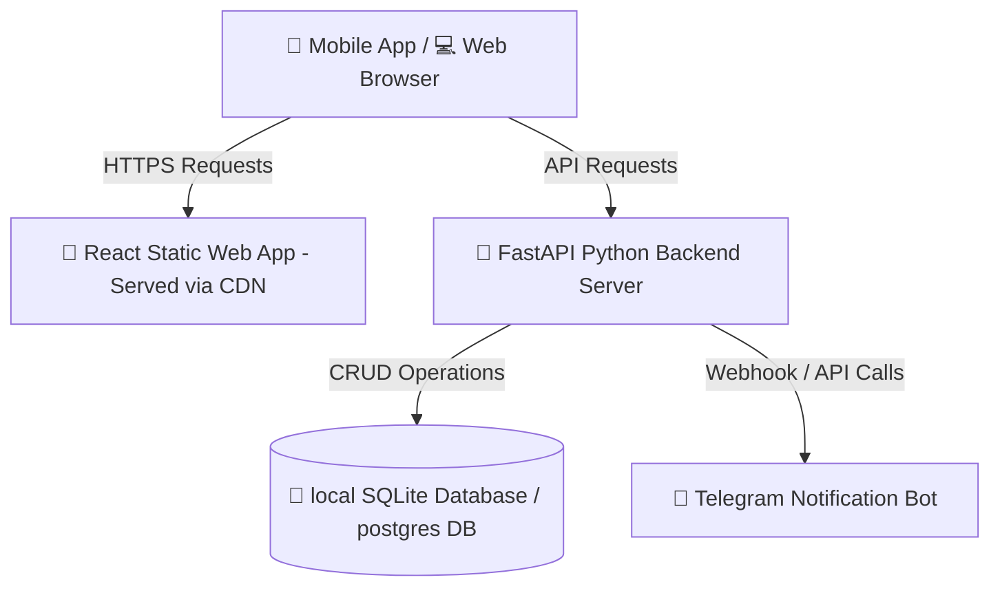

# 🌐 Inventory Management System (IMS) - Deployment Dossier

This document provides a highly professional, comprehensive guide detailing the production deployment configuration, parameters, and structural setup of the **Inventory Management System (IMS)**.

---

## 🏗️ Production Architecture Overview

The system is designed with a modern decoupled full-stack architecture, optimized for reliable production hosting on **Render** (Platform-as-a-Service):



---

## 🚀 Part 1: Backend Deployment Setup (Render)

The backend is built using **FastAPI** (Python) and runs as an active web service.

### 📋 Technical Configuration Specs
- **Service Type**: `Web Service`
- **Environment**: `Python`
- **Build Command**: `pip install -r requirements.txt`
- **Start Command**: `uvicorn app.main:app --host 0.0.0.0 --port $PORT`
- **Runtime Plan**: `Free Tier`

### 🔒 Environment Variables
Configure the following keys in the Render Service Settings dashboard:

| Environment Variable | Recommended Value | Purpose |
|----------------------|-------------------|---------|
| `SECRET_KEY` | *[Auto-Generated String]* | Secures JSON Web Tokens (JWT) for authentication. |
| `DATABASE_URL` | `sqlite:///./app/inventory.db` | Points SQLAlchemy to the local persistence database. |
| `TELEGRAM_BOT_TOKEN` | *[Your Bot Token]* | Integrates automated customer invoice messages. |

---

## 🎨 Part 2: Frontend Deployment Setup (Render)

The frontend is a single-page React application compiled using Vite.

### 📋 Technical Configuration Specs
- **Service Type**: `Static Site`
- **Build Command**: `npm run build`
- **Publish Directory**: `dist`
- **Runtime Plan**: `Free Tier`

### 🔒 Environment Variables
Configure the following compilation key during the build step:

| Environment Variable | Live Production Value | Purpose |
|----------------------|-----------------------|---------|
| `VITE_API_URL` | `https://ims-backend-7c60.onrender.com` | Declares the target API server. |

---

## ⚡ Part 3: Automated One-Click Deployment (Render Blueprints)

A premium `render.yaml` Blueprint file has been supplied in the `/deployment` folder. When pushed to GitHub, Render can parse this file to automatically instantiate, deploy, and link both services in a single click:

```yaml
# render.yaml snippet
services:
  - type: web
    name: ims-backend-service
    env: python
    buildCommand: pip install -r requirements.txt
    startCommand: uvicorn app.main:app --host 0.0.0.0 --port $PORT
```

---

## 🔑 Evaluator Test Credentials

For quick evaluation of the live dashboard, use the following sandbox credentials:

### 👑 Administrator Account
- **Username**: `admin`
- **Password**: `admin123`

### 💼 Staff Account
- **Username**: `staff`
- **Password**: `staff123`
